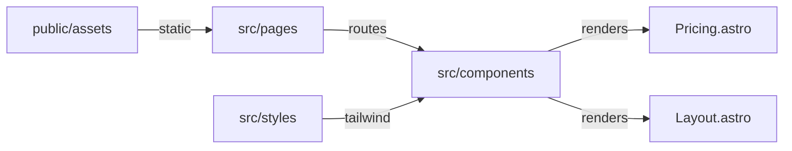

# Lodestar Context

> Project: kylex-landing
> Date: 2026-03-26
> Model: claude-opus

## Project Summary

Kylex is a developer tool for AI-assisted coding sessions. The landing page (kylex-landing) is a static Astro site with Tailwind CSS that markets the Free and Pro tiers of the product. It includes pricing, getting-started, and marketing pages.

**User Segments:**
- Individual developers using Claude Code, Cursor, or Windsurf
- Development teams needing session history and team sharing

## Integrations

No integrations detected.

## Project Brief Status

- [x] **Pricing page with Free and Pro tiers** — 100% — Free tier: local-only, 3-file history, CLI. Pro tier: hosted synthesis, 30-day history, session diff, team sharing, AI summaries, checkpoints. Updated this session to clarify feature messaging.
- [x] **Marketing and documentation pages** — 100% — Includes getting-started, landing, and other marketing content.

## Future Phases

No future phases defined.
## Diagrams

### Kylex Landing Site Structure [architecture]

## Decisions

### Pro tier includes hosted synthesis with no API key required

**Rationale:** Differentiates Pro from Free (which requires user's own API key). Removes friction for teams and enables Kylex-managed infrastructure benefits.
**Files:** src/components/Pricing.astro

### Session diff comparison is a Pro-tier feature (not Free)

**Rationale:** Positioning diff inspection as an advanced workflow feature that justifies upgrade. Pairs with 30-day history timeline and AI summaries.
**Files:** src/components/Pricing.astro

### Team sharing via shareable review URL is Pro-only

**Rationale:** Collaboration and auditability are Pro value drivers. Keeps Free tier scoped to individual developer use.
**Files:** src/components/Pricing.astro

### Free tier limited to 3-file session history (no timeline view)

**Rationale:** Clear feature boundary: Free = local-only fundamentals, Pro = managed history with inspection tools.
**Files:** src/components/Pricing.astro

## Patterns

- **Component-based UI architecture with Astro components** — src/components/ — each major section is an .astro file
- **Tailwind CSS utility classes for styling, color system uses #185FA5 (primary blue) and #0C447C (hover state)** — src/components/Pricing.astro and other .astro files
- **Pricing tiers presented as card components with feature lists and CTA buttons** — src/components/Pricing.astro — Free and Pro cards share consistent layout structure

## Dependencies

- **astro** — Static site generation and component-based templating
- **tailwindcss** — Utility-first CSS framework for styling
- **@tailwindcss/vite** — Tailwind CSS integration with Vite build system

## Rejected Approaches

No rejected approaches recorded.
## Open Questions

No open questions.

## Next Session

- Review Pro tier feature prioritization — ensure messaging aligns with backend roadmap (e.g., which features ship first: checkpoints, diff, summaries, or team sharing).
- Test pricing page on mobile to verify card layout and CTA button sizing under Tailwind breakpoints.
- Validate all 200-call monthly limit and pricing details match backend billing model.
