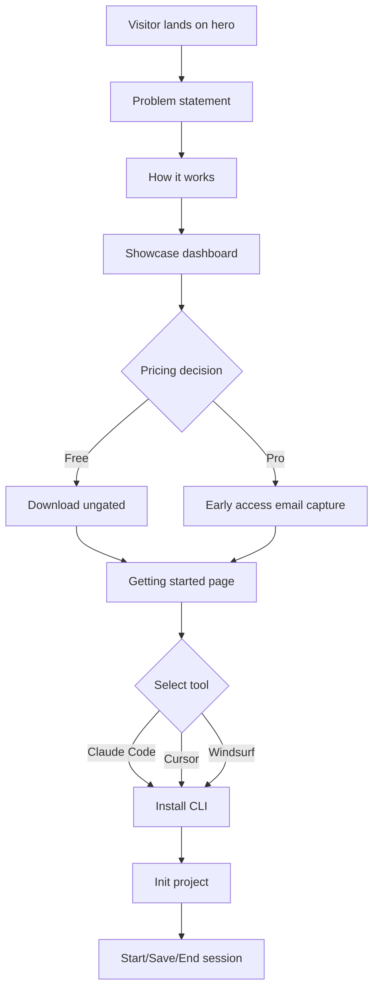

# Lodestar Context

> Project: kylex-landing
> Date: 2026-03-26
> Model: claude-opus
> Session Duration: not-specified

## Project Summary

Kylex is a developer tool for AI-assisted coding sessions. The landing page (kylex-landing) is a static Astro site with Tailwind CSS that markets the Free and Pro tiers of the product. It includes pricing, getting-started, and marketing pages. Branding uses 'Lodestar' until the full suite launches.

**User Segments:**
- Individual developers using Claude Code, Cursor, or Windsurf
- Development teams needing session history and team sharing

## Integrations

No integrations detected.

## Project Brief Status

- [x] **Pricing page with Free and Pro tiers** — 100% — Free tier: local-only, 3-file history, CLI, BYOK. Pro tier: hosted synthesis (no API key), 30-day history timeline, session diff, team sharing, AI summaries, checkpoints, 200 calls/month included. Feature list reordered this session to prioritize user workflows over infrastructure.
- [x] **Marketing and documentation pages** — 100% — Includes getting-started, landing, hero, problem statement, how-it-works, showcase (dashboard + .lodestar.md side-by-side), Pro early-access email capture, tool tabs. Ungated download. OG meta tags for social sharing.

## Future Phases

No future phases defined.
## Diagrams

### Kylex Landing Page User Journey [flow]

## Decisions

### Pro tier includes hosted synthesis with no API key required

**Rationale:** Differentiates Pro from Free (which requires user's own API key). Removes friction for teams and enables Kylex-managed infrastructure benefits.
**Files:** src/components/Pricing.astro

### Session diff comparison is a Pro-tier feature (not Free)

**Rationale:** Positioning diff inspection as an advanced workflow feature that justifies upgrade. Pairs with 30-day history timeline and AI summaries.
**Files:** src/components/Pricing.astro

### Team sharing via shareable review URL is Pro-only

**Rationale:** Collaboration and auditability are Pro value drivers. Keeps Free tier scoped to individual developer use.
**Files:** src/components/Pricing.astro

### Free tier limited to 3-file session history with no timeline view

**Rationale:** Clear feature boundary: Free = local-only fundamentals, Pro = managed history with inspection tools. Free users cannot view history timeline; only Pro can.
**Files:** src/components/Pricing.astro

### Pro feature messaging reordered: timeline → diff → sharing → summary → infrastructure

**Rationale:** Emphasizes user-facing workflow features (30-day history timeline, diff comparison, team collaboration) before infrastructure benefits (hosted synthesis, checkpoints). Positions diff and sharing as primary upgrade motivators.
**Files:** src/components/Pricing.astro

## Patterns

- **Component-based UI architecture with Astro components** — src/components/ — each major section is an .astro file (Pricing.astro, Layout.astro, etc.)
- **Tailwind CSS utility classes for styling with consistent color system** — src/components/ — primary blue #185FA5, hover state #0C447C, inactive text slate-400, checkmark spans use text-[#185FA5]
- **Pricing tiers presented as card components with feature lists, bold emphasis for Pro highlights** — src/components/Pricing.astro — Free and Pro cards share layout structure, Pro exclusive features use font-semibold and <strong> tags

## Dependencies

- **astro** — Static site generation and component-based templating
- **tailwindcss** — Utility-first CSS framework for styling
- **@tailwindcss/vite** — Tailwind CSS integration with Vite build system

## Rejected Approaches

No rejected approaches recorded.
## Open Questions

- [non-blocking] Do Pro feature ship dates and relative priority (checkpoints, diff, summaries, team sharing) need to be communicated on pricing page, or does current messaging match backend roadmap?

## Next Session

- Test pricing page on mobile to verify card layout and CTA button sizing under Tailwind breakpoints.
- Validate 200-call monthly limit and pricing details match backend billing model.
- Confirm Pro feature prioritization messaging (timeline → diff → sharing → summary) aligns with actual backend delivery timeline.
