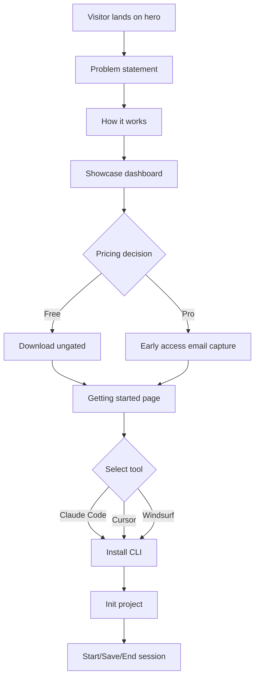

# Lodestar Context

> Project: kylex-landing
> Date: 2026-03-28
> Model: claude-opus-4-5
> Session Duration: not-specified

## Project Summary

Kylex is a developer tool for AI-assisted coding sessions. The landing page (kylex-landing) is a static Astro site with Tailwind CSS that markets the Free and Pro tiers of the product. It includes pricing, getting-started, and marketing pages. Branding uses 'Lodestar' until the full suite launches.

**User Segments:**
- Individual developers using Claude Code, Cursor, or Windsurf
- Development teams needing session history and team sharing

## Integrations

No integrations detected.

## Project Brief Status

- [x] **Pricing page with Free and Pro tiers** — 100% — Free tier: local-only, 3-file history, CLI, BYOK. Pro tier: hosted synthesis (no API key), 30-day history timeline, session diff, team sharing, AI summaries, checkpoints, 200 calls/month included.
- [x] **Marketing and documentation pages** — 100% — Includes getting-started, landing, hero, problem statement, how-it-works, showcase (dashboard + .lodestar.md side-by-side), Pro early-access email capture, tool tabs. Ungated download. OG meta tags for social sharing.
- [x] **Logo and branding updates** — 100% — Updated SVG logo to include 'by Kylex' micro text. Logo renders at h-36 in Hero, h-7 in Nav, h-7 in Footer.
- [x] **Navigation refinements** — 100% — Active section highlighting via scroll listener. Get Started button is outlined (ghost) when on /getting-started, filled blue otherwise. Back-to-top button added to Layout.astro, appears after 400px scroll.
- [x] **Back-to-top button** — 100% — Fixed bottom-center, blue circle, appears after 400px scroll, smooth scroll to top. Implemented in Layout.astro.
- [x] **Active nav highlighting on scroll** — 100% — Scroll listener in Nav.astro highlights the nav link whose section is in viewport (top <= 100, bottom > 100). Uses data-section attribute on anchor tags.

## Future Phases

No future phases defined.
## Diagrams

### Kylex Landing Page User Journey [flow]

## Decisions

### Pro tier includes hosted synthesis with no API key required

**Rationale:** Differentiates Pro from Free (which requires user's own API key). Removes friction for teams and enables Kylex-managed infrastructure benefits.
**Files:** src/components/Pricing.astro

### Ungated download for Free tier with no email capture required

**Rationale:** Reduces friction for individual developers. Email capture only at Pro early-access stage, not at Free download.
**Files:** src/components/Pricing.astro

### Get Started nav button changes style contextually based on current page

**Rationale:** When on /getting-started the button renders as outlined/ghost to avoid visual redundancy with the active page. On all other pages it renders as a solid filled CTA to drive conversion.
**Files:** src/components/Nav.astro

### Active nav section detection via scroll position using getBoundingClientRect threshold at 100px

**Rationale:** Highlights which landing page section the user is currently reading without a third-party scroll library. Threshold of 100px accounts for the fixed nav bar height.
**Files:** src/components/Nav.astro

### Logo updated to include 'by Kylex' micro text

**Rationale:** Establishes brand ownership clarity while maintaining 'Lodestar' as primary product name until full suite launch.
**Files:** src/components/Footer.astro, src/components/Hero.astro

## Patterns

- **Component-based UI architecture with Astro components — each major section is an .astro file** — src/components/ (Pricing.astro, Layout.astro, Hero.astro, Footer.astro, Nav.astro)
- **Tailwind CSS utility classes with consistent color system — primary blue #185FA5, hover #0C447C, inactive slate-400** — src/components/
- **Inline script tags inside .astro files for component-scoped browser behavior (scroll listeners, class toggling)** — src/components/Nav.astro, src/layouts/Layout.astro
- **Navigation uses hash anchors (/#how-it-works, /#pricing) and Astro.url.pathname for active page detection** — src/components/Nav.astro
- **SVG logo embedded inline with context-dependent scaling via class-based sizing (h-7 nav/footer, h-36 hero)** — src/components/Hero.astro, src/components/Nav.astro, src/components/Footer.astro

## Dependencies

- **astro** — Static site generation and component-based templating
- **tailwindcss** — Utility-first CSS framework for styling
- **@tailwindcss/vite** — Tailwind CSS integration with Vite build system

## Rejected Approaches

### Email capture gate on Free tier download

**Reason:** Product decided on ungated download (Option B) to reduce friction for individual developers. Email capture reserved for Pro early-access funnel only.

### SSH key setup for Bluehost deployment

**Reason:** SSH key configuration failed; fell back to File Manager upload for deploying the dist build.

## Open Questions

- [non-blocking] Do Pro feature ship dates and relative priority (checkpoints, diff, summaries, team sharing) need to be communicated on the pricing page, or does current messaging match backend roadmap?

## Next Session

- Commit uncommitted Nav.astro and Layout.astro changes, then rebuild dist and redeploy to Bluehost via File Manager.
- Test active nav highlighting and back-to-top button on deployed site across mobile and desktop.
- Verify Get Started button ghost/filled state renders correctly when navigating between landing page and /getting-started.
- Validate logo 'by Kylex' micro text readability at h-7 (nav/footer) on mobile screens.
