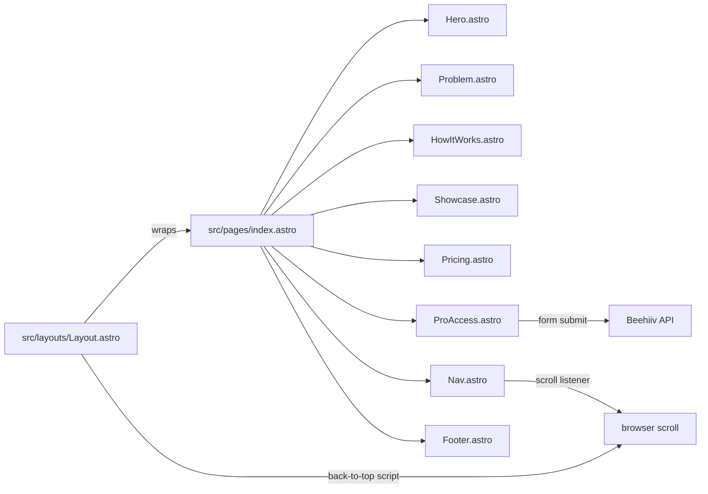

# Lodestar Context

> Project: kylex-landing
> Date: 2026-03-28
> Model: claude-opus-4-5
> Session Duration: not-specified

## Project Summary

Kylex is a developer tool for AI-assisted coding sessions. The landing page (kylex-landing) is a static Astro site with Tailwind CSS that markets the Free and Pro tiers of the product under the 'Lodestar' brand. Includes pricing, getting-started, and marketing pages. Positioning is locked: flow state continuity frame, LLM-agnostic, hero headline and tagline are frozen for launch.

**User Segments:**
- Individual developers using Claude Code, Cursor, or Windsurf
- Development teams needing session history and team sharing
- Founders who ship with AI (vibe-coding audience)

## Integrations

- **Beehiiv** [other] — Email capture for Pro early-access signups. API call on form submit triggers welcome email with download link. Free up to 2,500 subscribers.

## Project Brief Status

- [x] **Pricing page with Free and Pro tiers** — 100% — Free: local-only, 3-file history, CLI, BYOK. Pro: hosted synthesis (no API key), 30-day history, session diff, team sharing, AI summaries, checkpoints, 200 calls/month.
- [x] **Marketing and documentation pages** — 100% — Getting-started, landing, hero, problem, how-it-works, showcase, Pro early-access email capture, tool tabs. OG meta tags.
- [-] **Hero and landing page copy refresh** — 80% — Hero headline, subhead, Problem section, HowItWorks step 3, ProAccess description, and page title/description updated in uncommitted changes. Showcase.astro also modified (diff not shown). Not yet committed.
- [x] **Navigation refinements** — 100% — Active section highlighting via scroll listener. Get Started button outlined on /getting-started, filled blue elsewhere. Back-to-top button in Layout.astro.
- [x] **Logo and branding** — 100% — SVG logo includes 'by Kylex' micro text. h-36 hero, h-7 nav/footer.

## Future Phases

No future phases defined.
## Diagrams

### Kylex Landing Site Architecture [architecture]

## Decisions

### Positioning locked to flow state continuity frame — not session amnesia recovery

**Rationale:** Amnesia frame positions Lodestar as fixing a failure. Continuity frame positions it as protecting something valuable. All surfaces must reinforce continuity. Hero headline, tagline, one-liner, and pain copy are frozen for launch.
**Files:** CLAUDE.md, src/components/Hero.astro, src/components/Problem.astro, src/pages/index.astro

### LLM-agnostic positioning throughout — Lodestar is a codebase feature, not a Claude Code accessory

**Rationale:** Prevents Lodestar from being perceived as tied to one AI tool. Enables positioning across Claude Code, Cursor, Windsurf, and future tools. Inoculation line for technical readers: 'CLAUDE.md tells your tool how to behave. Lodestar tells it what already happened.'
**Files:** CLAUDE.md, src/components/Hero.astro

### Binary-only distribution via GitHub Releases (no email gate) and kylex.io email capture in parallel

**Rationale:** GitHub track maximizes developer virality with zero friction. kylex.io track builds email list via Beehiiv for launch announcement sequence. Neither gates the binary behind email.
**Files:** CLAUDE.md

### Pro tier includes hosted synthesis with no API key required

**Rationale:** Differentiates Pro from Free (which requires user's own API key). Removes friction for teams.
**Files:** src/components/Pricing.astro

### Get Started nav button changes style contextually based on current page

**Rationale:** On /getting-started renders as outlined/ghost to avoid redundancy. On all other pages renders as solid filled CTA to drive conversion.
**Files:** src/components/Nav.astro

## Patterns

- **Component-based UI — each major landing section is a standalone .astro file in src/components/** — src/components/ (Hero.astro, Problem.astro, HowItWorks.astro, Showcase.astro, Pricing.astro, ProAccess.astro, Nav.astro, Footer.astro)
- **Tailwind utility classes with locked color system — primary #185FA5, hover/dark #0C447C, light bg #E6F1FB, inactive slate-400/500** — src/components/
- **Inline script tags inside .astro files for component-scoped browser behavior (scroll listeners, class toggling)** — src/components/Nav.astro, src/layouts/Layout.astro
- **Navigation uses hash anchors (/#how-it-works, /#pricing) with data-section attributes for scroll-based active state detection at 100px threshold** — src/components/Nav.astro

## Dependencies

- **astro** — Static site generation and component-based templating
- **tailwindcss** — Utility-first CSS framework for styling
- **@tailwindcss/vite** — Tailwind CSS integration with Vite build system

## Rejected Approaches

### Email capture gate on Free tier download

**Reason:** Product decided on ungated download to reduce friction for individual developers. Email capture reserved for Pro early-access funnel only.

### SSH key setup for Bluehost deployment

**Reason:** SSH key configuration failed; fell back to File Manager upload for deploying the dist build.

## Open Questions

- [non-blocking] Do Pro feature ship dates and relative priority (checkpoints, diff, summaries, team sharing) need to be communicated on the pricing page, or does current messaging match backend roadmap?

## Next Session

- Commit the 5 modified files (Hero.astro, Problem.astro, HowItWorks.astro, ProAccess.astro, Showcase.astro, index.astro) — copy refresh is complete and staged.
- Rebuild dist and redeploy to Bluehost via File Manager after committing.
- Verify deployed copy matches locked positioning — hero headline, tagline, pain copy, and LLM-agnostic framing should all reflect CLAUDE.md.
- Test Get Started button ghost/filled state and active nav highlighting on deployed site across mobile and desktop.
